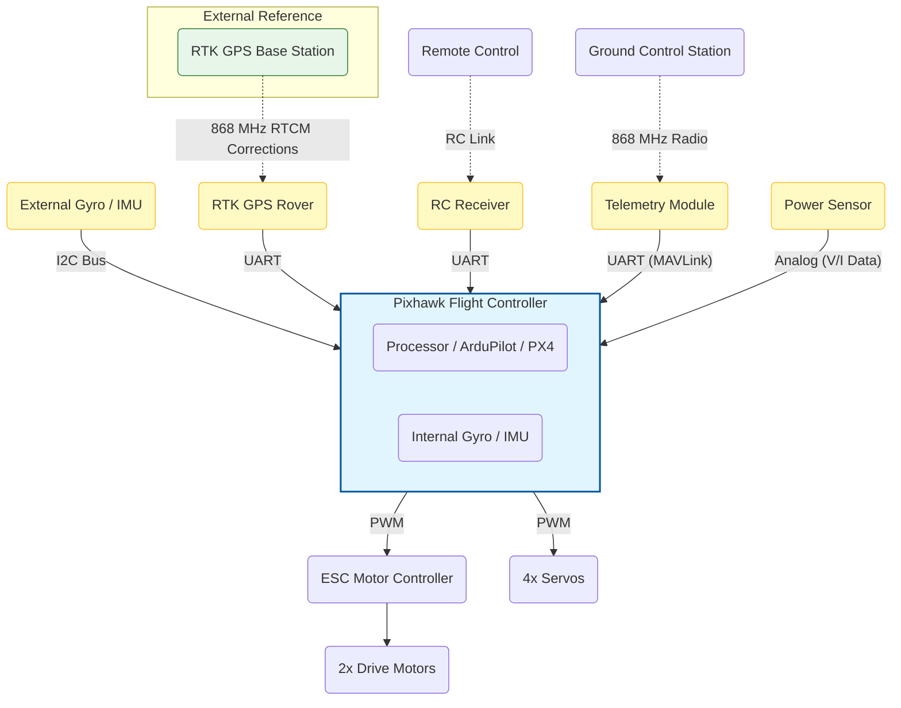
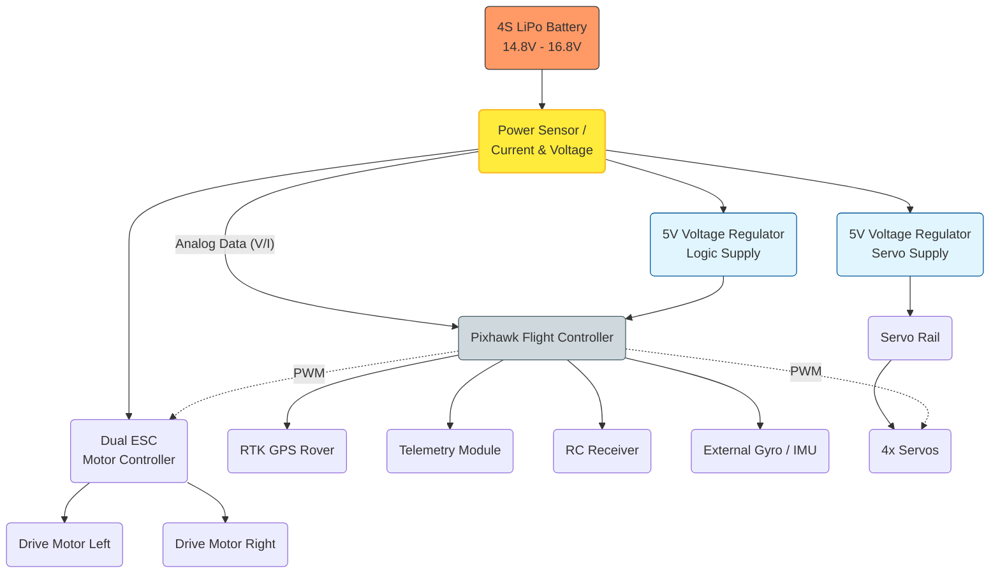
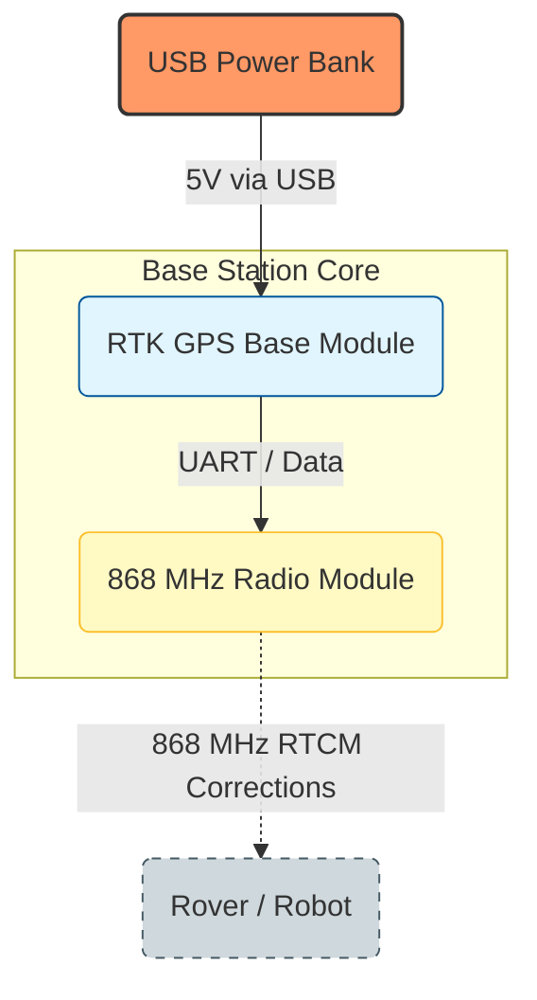
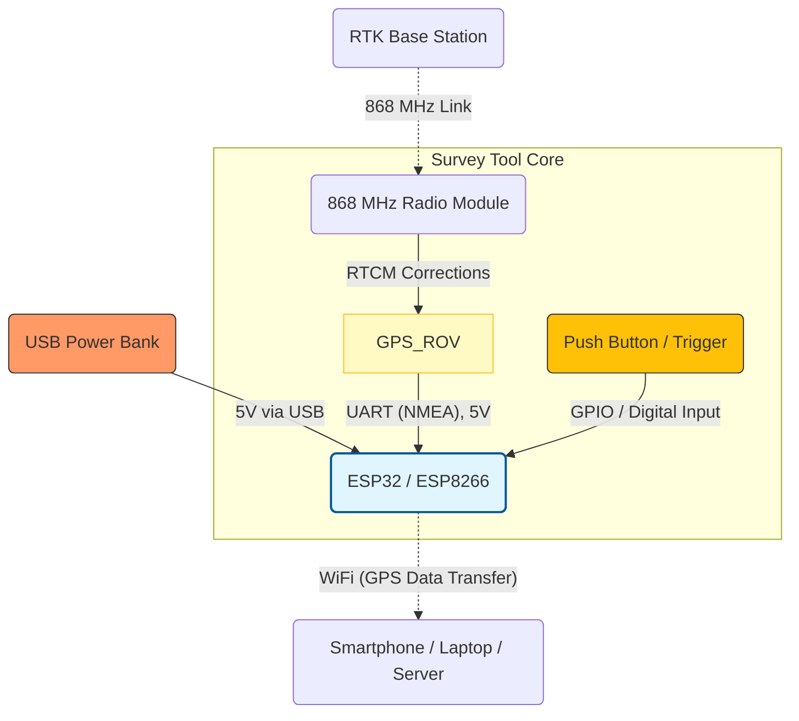
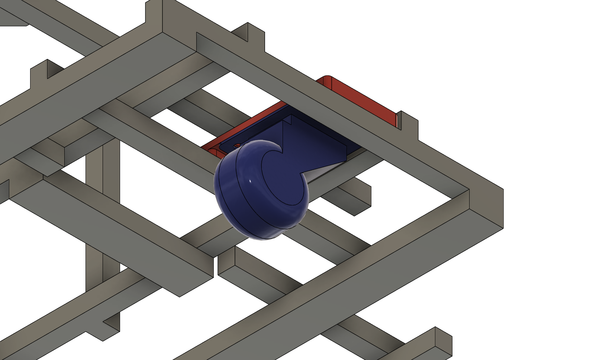
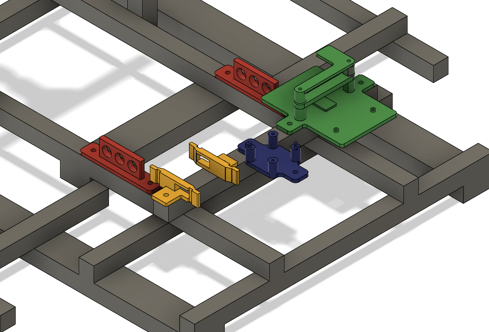

# RoadMarkerBot

An open-source road marking bot with

- skid steering
- differential GPS (Base + Rover)
- Ardupilot
- multiple colors
- dual use as a survey tool.

## Architecture

### System Architecture

### Electrical Design

#### Rover

#### RTK Base Station

#### Survey Stick

### Mechanical Design

The robot was designed as a skid steer vehicle with a trailing third wheel.
An extensible design was chosen to allow quick modifications.
Overall vehicle dimensions: width 600 mm, length 500 mm, height 400 mm

Built with:

- 20×20 mm aluminium extrusions to mount various components
- high gear reduction on the motors for precise maneuvers
- simple power supply using 18 V batteries compatible with Makita or Bosch
- readily available hobby-model parts
- autonomous control via ArduPilot software
- four spray cans can be mounted and all spray to the same point

ROVER: Images

BASE: Images

ROVER: Pixhawk Config

SURVEY TOOL: Images

ROVER: Pixhawk Config

#### Config Files

ROVER: Pixhawk Config

ROVER: Pixhawk Config

ROVER: uBlox F9P Config

ROVER: uBlox F9P Config

ROVER: ESC Config

ROVER: ESC Config

BASE: uBlox F9P Config

BASE: uBlox F9P Config

SURVEY TOOL: ESP Config

SURVEY TOOL: ESP Config

