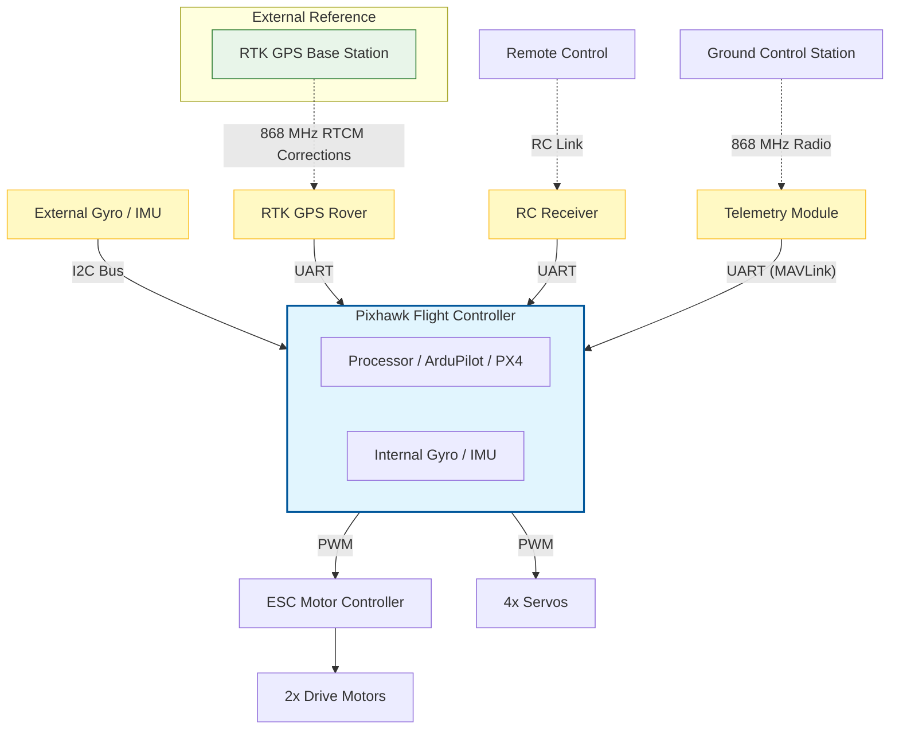

# RoadMarkerBot
An open-source road marking bot with 
- skid steering
- differential GPS (Base + Rover)
- Ardupilot
- multiple colors.

## Architecture

### System Architecture

### Electrical Design

### Mechanical Design

### Resources

#### BOM

| Rover (Mechanics) | Rover (Electrics) | Misc |
| ----------------- | ----------------- | -----|
| | | |
| | | |
| | | |
| | | |
| | | |
| | | |
| | | |

#### Config Files
