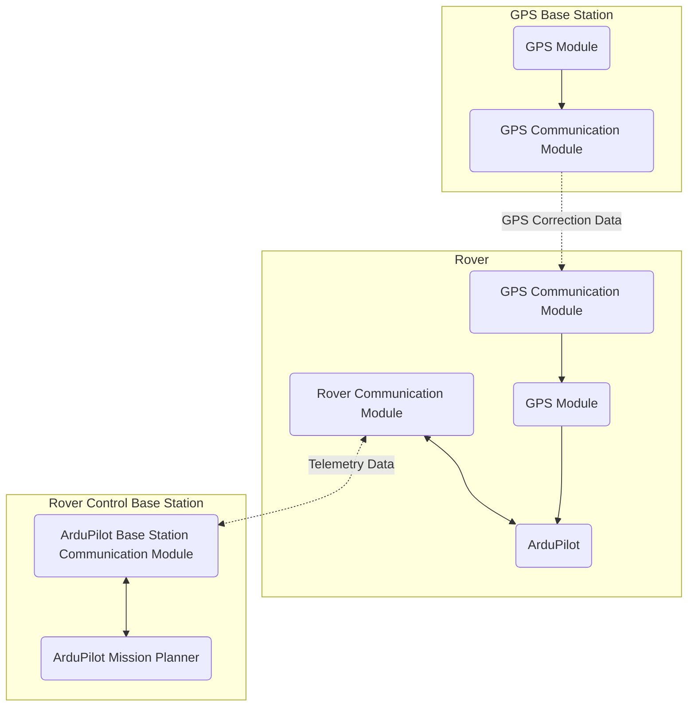

# RoadMarkerBot

An open-source road marking rover with

- skid steering
- differential GPS (Base + Rover)
- Ardupilot
- multiple colors
- dual use as a survey tool.

## Requirements

- The rover should be able to spray a dot onto pavement at a position defined by GPS.
- The rover should be remotely controllable in order to halt its operation, move around obstacles, and manually drive it for small distances.
- The rover should accept a series of GPS positions in order to mark more complicated tracks.
- The rover should ideally be constructed from off-the-shelf components for easy replacement.
- Rover GPS can be also used as survey tool for manual measurements without the need to move the rover there.

## Solution

The system is divided into subsystems in order to fulfil the requirements.

- The rover is constructed a skid steer robot to realize turning on the spot.
- The rover uses differential GPS for accurate positioning.
- The rover uses ArduPilot in order to provide a platform for vehicle movement and an interface to input target GPS positions.
- The rover can carry four different spray cans at once to use different colors without manual interaction.
- The rover is controlled with an ELRS rc controller in order to provide easy manual input.
- The rover is mainly constucted from aluminium extrusions, 3D prints, rc hobby electronics and available software.

### Architecture

### In Detail

[LINK TO ROVER DOCUMENTATION](./rover/README.md) 
[LINK TO GPS BASE STATION DOCUMENTATION](./rover/config.md) 
[LINK TO CONTROL BASE STATION DOCUMENTATION](./rover/config.md) 
[LINK TO SURVEY TOOL DOCUMENTATION](./rover/config.md)

## Known Issues

- ArduPilot on Rover currently can only handle around 100 waypoints.
- Rover initialization is currently driving in a large circle to be able to fully use the gyroscope. Magnetometer is currently disabled due to inreliable operation. Hence initial heading is unclear to ArduPilot and it needs to calibrate itself using gyroscope in GPS before starting any mission.
- Starting any movement looks a little jenky and stopping is quite abrupt, which hints to improper PID calibration or ESC configuration.
