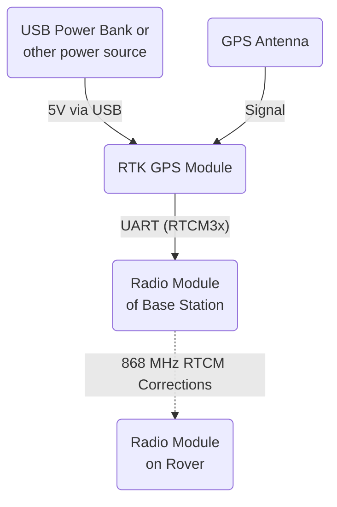

# GPS Base Station

## Architecture

## Design

The GPS base station is a rather simple setup and was put together from remaining parts and simple 3D printed parts in order to make a solid yet reliable device.
It is about 1000mm in height (to get the antenna off the ground without being too susceptable to wind) and the metal shield at the top has an excessive 300mm diameter (to reduce reflections as much as possible).
It is also built from 20x20mm aluminium extrusions.
The whole system is powered by a regular powerbank and will run for quite some time on it as is only draws about 150mA of current when sending correction data.
The antenna is put to the corner of the upper shield to be also elevated off the ground.

## Usage

- The antenna is placed on a dedicated spot and the ground is marked so the antenna can be placed there repeatedly in the exact same position.
- Ideally the spot is surveyed in by using the antenna, a laptop with [u-Center](https://www.u-blox.com/en/product/u-center), some free Ntrip data service like [RTK2Go](http://rtk2go.com), and the rover GPS config (see [Rover GPS Config](ROVER_LINKS)) to find the exact position the GPS is currently in.
This can then be entered in the config of the GPS base station to run it in fixed mode.
- Both communication modules need to use the same config to communicate properly.

## Links

[GPS Base uBlox Config](./config/uBlox_F9P_Base_config.txt) 
[XBee RTCM Config](./config/GPS_RTCM_XBeeSX686_fwA00A.xpro) 
[CAD files](./cad/)
