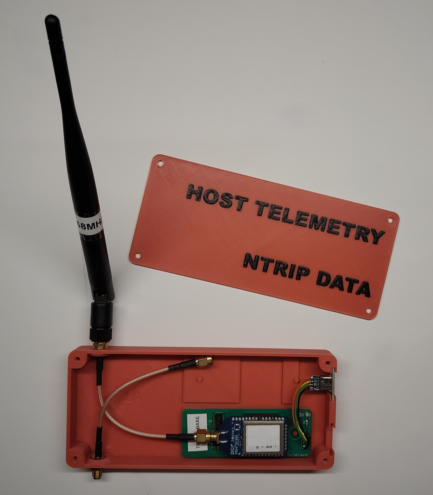

# Overview

The Ground Control Station is needed to send the mission waypoints to the rover and communicate with it in the field.
For that it is easiest to run a software like [Mission Planner](https://ardupilot.org/planner/docs/mission-planner-installation.html) and have a reliable connection to the rover.
This can be a USB cable, WiFi, an pair of 868MHz radio modules, or another sort of communication.
In this project a XBee SX 686 module was used, which had the advantage of substantial range at the expense of insanely slow bulk data transfer.
The profile of the modules can be found [HERE](./HostTelemetry_XBeeSX686_fwA00A.xpro) and can be used with the [XCTU Tool](https://www.digi.com/products/embedded-systems/digi-xbee/digi-xbee-tools/xctu) to configure the module.
**Hint:** The guard time in that profile is set to 5000ms and this needs to be configured in the XCTU Tool itself as well.

## Mission Planner

Choose the proper COM port to get access to the data coming from the XBee module.
In this project a 115200 8N1 was chosen as baud rate.

## Equipment

### Case

In this project a nice little case was designed, that was intended to house two modules, but was used by only one in the end.

### PCB

For this project a custom PCB was designed. The KiCAD project can be found [HERE](./telemetry_pcb.zip).
The lower picture shows an earlier version of the board.

