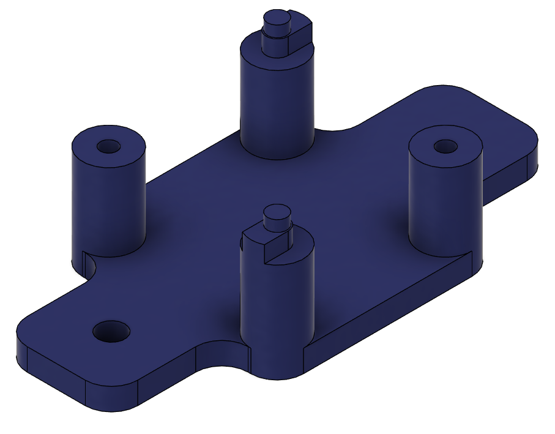
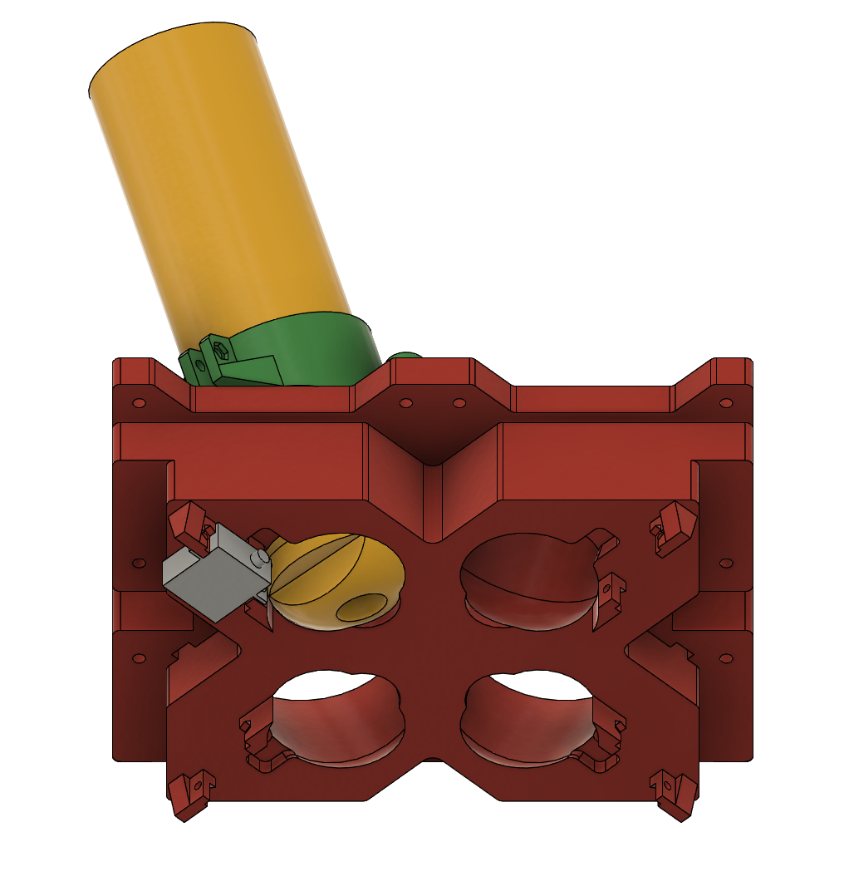

# Rover

## Image Gallery

### Frame

### Wheel Assembly

### Spray Can Assembly

### Electronic Component Mounts

### Full Model

## Details

### Flight Controller

As flight controller a *Pixhawk 2.4.8* was used due to high availability at reasonable prices.
This comes at the cost of limited computational power when handling waypoints.
The flight controller has enough IO ports and can run ArduPilot, which was used for the project.
The config file for the flight controller can be found [HERE](pixhawk_config.txt). <!-- MISSING -->
In order to fix the flight controller to the frame two side supports are used.
The step file can be found [HERE](./pixhawk_mount.step).
It has a cutout for the USB port and as it is symmetric, it is needed twice.

 <!-- MISSING -->

### ESC

For this project a BLHELI32 compatible ESC was used due to its configurability.
The exact part was a *T-Motor P60A v2*, which proides 60A from 3-6S LiPo batteries.
To run the motors, this config was used on output M3 and M4.
For configuration a *Sequre ESC-Link* and the *BlHeli32 Suite* was used.
The ESC itself is mounted to the frame and also provides connectors for the motor wiring.
Both step files can be found [HERE](./esc_mount.step) and [HERE](./banana_plug_mount.step).

 <!-- MISSING -->

 <!-- MISSING -->

### Connection PCB

This board is intended to have a common connector for all sensors and actors connected to the Pixhawk.
This specifically applies to GPS, Servos, ELRS receiver, ESC, and the telemetry radio module.
It is also intended to be used to convert voltage from battery to 5V and 3.3V.
The KiCad file can be found [HERE](dotty2_adapter_board.zip) and the STEP file to hold down the radio module can be found [HERE](dotty2_adpater_board_radio_module_retainer.step).

 <!-- MISSING -->
)
) <!-- MISSING -->

### GPS

On the rover and the base station a board with *uBlox F9P* module is used.
The particular part is an *ArduSimple simpleRTK2B* with *Radio Module Long Range (LR)* and *ANN-MB-00* antenna.
The GPS module is mounted below the [Connection PCB](connection_pcb).
)
) <!-- MISSING -->
The step files for the base can be found [HERE](gps_mount_base.step) and the one for the retainer can be found [HERE](gps_mount_retainer.step).
The config file for the GPS can be found [HERE](MISSING) and can be applied using the [u-Center](LINK-MISSING).
The config file for the radio module can be found [HERE](GPS_RTCM_XBeeSX686_fwA00A.xpro) and should also be used on the [Base Station](base_station_gps).
The antenna is placed on a 200x200x1mm sheet of aluminium to filter out ground reflections.
 <!-- MISSING -->

### Power Supply

For this project the focus was availibility of power sources, so an adapter to run off batteries compatible with Bosch's 18V system.
Initially two batteries were planned, but due to very small power draw, the rover runs for several kilometers on a single battery.
Due to reverse current protection a battery can be added during operation and the other one can be pull from the rover without interrupting operation.
 <!-- MISSING -->
 <!-- MISSING -->

### Motor / Wheel Setup

For this project powerful and low-KV motors were used.
The purpose was to make small corrections with the high torque and low rpm.
In addition a reduction of about 45:1 was achieved by a gearbox (19:1) and pulleys (2.35:1).
This specific BLDC motor is a *Robbe 5052 410K/V* rated for 50A at 6S.
Due to the reduction the rover reaches speeds of about 5km/h.

 <!-- MISSING -->
 <!-- MISSING -->
The wheel itself is a solid rubber 190mm replacement wheel for e-scooters and was adapted to carry a pully.
All the parts can be found in [THIS](./motor_wheel_parts.zip) archive.  <!-- MISSING -->

### Spray Can Pods

The spray can pod is designed in a way, that all four cans mark the same spot right in the center of the (imaginary) front axle.
The pod is printed in one piece and is intended to make the frame more rigid.
The cans can be attached and detached after loosening the thumb screw.
This pod is designed around a chalk marking spray from Technima.
On the under side the trigger of the cans are activated by servos, which are in turn covered to prevent dirt and debris from damaging the rover while in operation.

 <!-- MISSING -->

 <!-- MISSING -->
