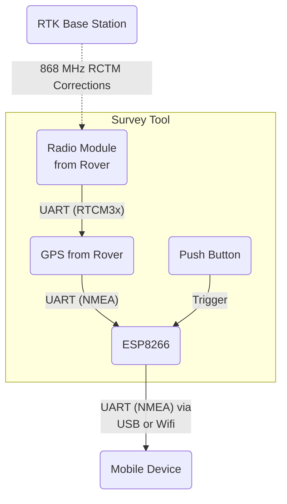
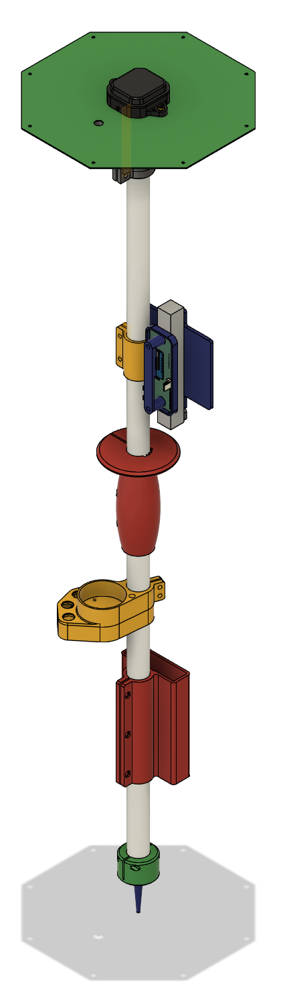

# Survey Tool

## Architecture

```mermaid
graph TD
    
    %% Communication & Interface
    subgraph Handheld_Unit [Survey Tool]
        ESP
        BTN(Push Button)
        GPS_ROV(GPS from Rover)
        RADIO(Radio Module<br>from Rover)
    end
    ESP(ESP8266)

    %% Data Connections
    RADIO -- "UART (RTCM3x)" --> GPS_ROV
    GPS_ROV -- "UART (NMEA)" --> ESP
    BTN -- "Trigger" --> ESP

    %% External Links
    BASE(RTK Base Station) -. "868 MHz RCTM Corrections" .-> RADIO
    ESP -- "UART (NMEA) via<br>USB or Wifi" --> SERVER(Mobile Device)
```

## Design

